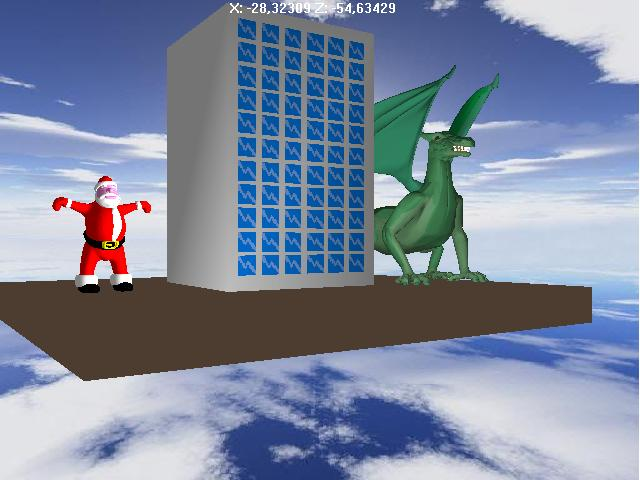

<div align="center">

## My 1st Direct 3D demo


</div>

### Description

This is an old project I did back in highschool to teach myself some DirectX
 
### More Info
 


<span>             |<span>
---                |---
**Submitted On**   |
**By**             |[Lefteris Eleftheriades](https://github.com/Planet-Source-Code/PSCIndex/blob/master/ByAuthor/lefteris-eleftheriades.md)
**Level**          |Advanced
**User Rating**    |5.0 (20 globes from 4 users)
**Compatibility**  |VB 6\.0
**Category**       |[DirectX](https://github.com/Planet-Source-Code/PSCIndex/blob/master/ByCategory/directx__1-44.md)
**World**          |[Visual Basic](https://github.com/Planet-Source-Code/PSCIndex/blob/master/ByWorld/visual-basic.md)
**Archive File**   |[](https://github.com/Planet-Source-Code/lefteris-eleftheriades-my-1st-direct-3d-demo__1-43881/archive/master.zip)


### Source Code

```
<p>Unfortunately PSC doen't let me upload pictures so I use an external link. Vistit it and bookmark it.</p>
<p>http://agrino.org/hsg/DirectX/DX.htm</p>
```

